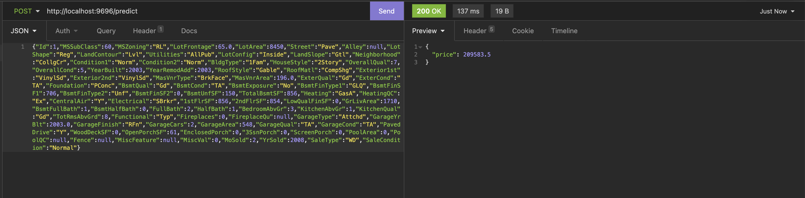
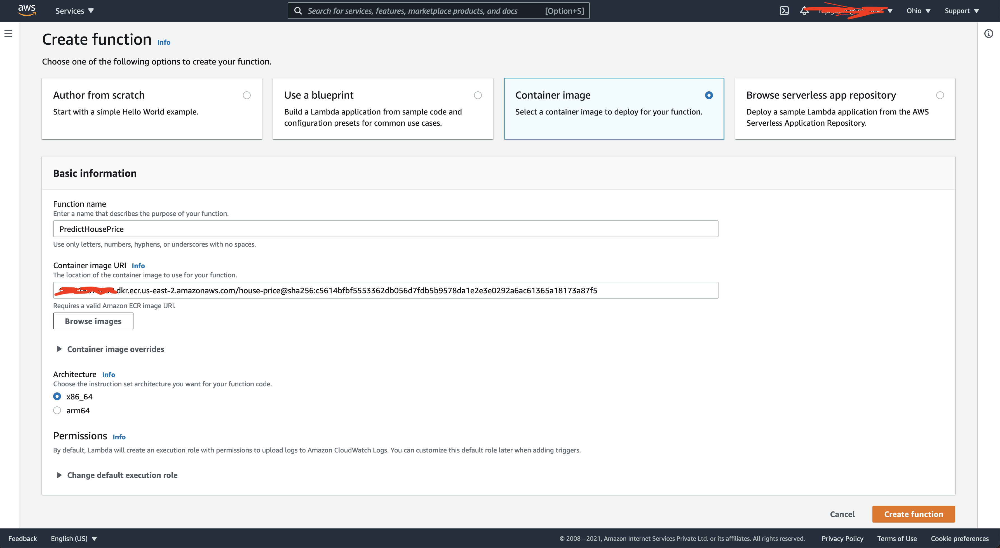
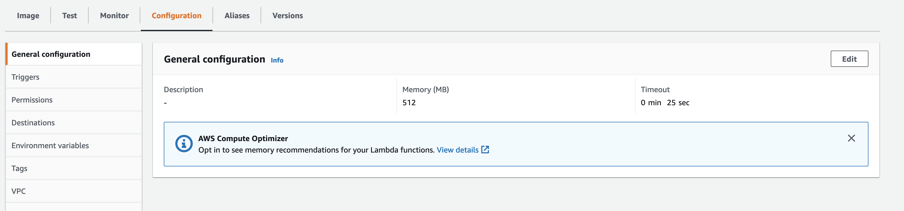
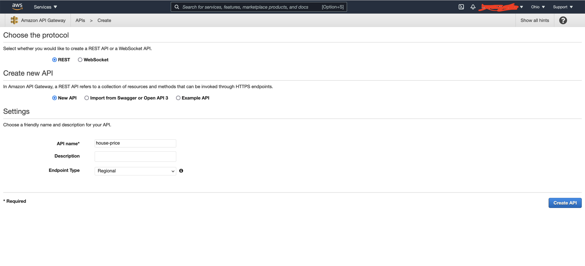
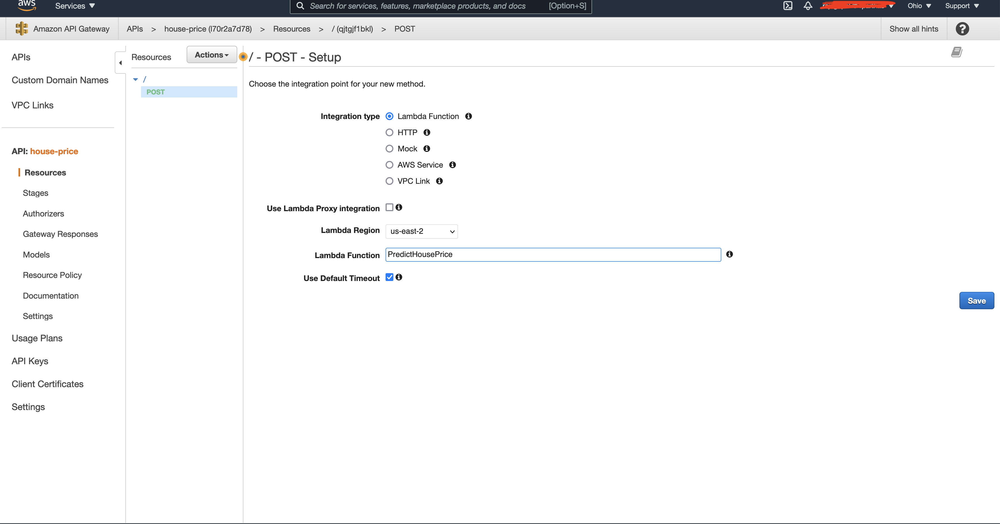
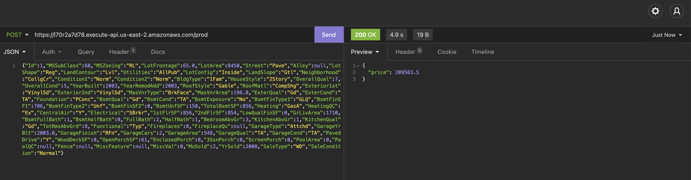

# Problem Description

This is a dataset about homes in IOWA. It includes 79 explanatory variables describing (almost) every aspect of residential homes in Ames, Iowa
The goal is to predict the final price of home given similar conditions. 

Dataset description is provided in ```data/data_description.txt``` . This explains each variable related to the dataset.

# Solution Steps

* split the data into training and validation
* Fill numerical Columns missing values with 0
* Fill categorical Columns missing values with unknown
* Do one hot encoding for categorical columns
* Use mutual_info_regression to eliminate features with zero correlation 
* ```custom_transformer.py``` is used for this effect. Separate file for pickling support
* Use PCA to transform into lower dimension space(Reduce number of features)
* Run Random Forest(Tree based model) with grid search for optimal parameters
* Run Linear model with grid search for optimal parameters

# How to run
Prerequisites : Python, Virtualenv
* Create virtual environment using the command ```python -m venv midterm_venv```
* Activate the environment by ```midterm_venv/bin/activate```
* Run ```pipenv install``` to install the dependencies within the activated virtual environment
* Run ```python train.py``` to generate the model file
* Best parameters have been identified by running the notebook ```model.ipynb```
* Install jupyter-notebook if you need to run the notebook
* Once model is trained, you can run the prediction script locally by running 
```gunicorn --bind 0.0.0.0:9696 predict_house_price:app```

* Sample Screenshot is provided for testing endpoint


### Sample Data
```json
{
  "Id": 1,
  "MSSubClass": 60,
  "MSZoning": "RL",
  "LotFrontage": 65,
  "LotArea": 8450,
  "Street": "Pave",
  "Alley": null,
  "LotShape": "Reg",
  "LandContour": "Lvl",
  "Utilities": "AllPub",
  "LotConfig": "Inside",
  "LandSlope": "Gtl",
  "Neighborhood": "CollgCr",
  "Condition1": "Norm",
  "Condition2": "Norm",
  "BldgType": "1Fam",
  "HouseStyle": "2Story",
  "OverallQual": 7,
  "OverallCond": 5,
  "YearBuilt": 2003,
  "YearRemodAdd": 2003,
  "RoofStyle": "Gable",
  "RoofMatl": "CompShg",
  "Exterior1st": "VinylSd",
  "Exterior2nd": "VinylSd",
  "MasVnrType": "BrkFace",
  "MasVnrArea": 196,
  "ExterQual": "Gd",
  "ExterCond": "TA",
  "Foundation": "PConc",
  "BsmtQual": "Gd",
  "BsmtCond": "TA",
  "BsmtExposure": "No",
  "BsmtFinType1": "GLQ",
  "BsmtFinSF1": 706,
  "BsmtFinType2": "Unf",
  "BsmtFinSF2": 0,
  "BsmtUnfSF": 150,
  "TotalBsmtSF": 856,
  "Heating": "GasA",
  "HeatingQC": "Ex",
  "CentralAir": "Y",
  "Electrical": "SBrkr",
  "1stFlrSF": 856,
  "2ndFlrSF": 854,
  "LowQualFinSF": 0,
  "GrLivArea": 1710,
  "BsmtFullBath": 1,
  "BsmtHalfBath": 0,
  "FullBath": 2,
  "HalfBath": 1,
  "BedroomAbvGr": 3,
  "KitchenAbvGr": 1,
  "KitchenQual": "Gd",
  "TotRmsAbvGrd": 8,
  "Functional": "Typ",
  "Fireplaces": 0,
  "FireplaceQu": null,
  "GarageType": "Attchd",
  "GarageYrBlt": 2003,
  "GarageFinish": "RFn",
  "GarageCars": 2,
  "GarageArea": 548,
  "GarageQual": "TA",
  "GarageCond": "TA",
  "PavedDrive": "Y",
  "WoodDeckSF": 0,
  "OpenPorchSF": 61,
  "EnclosedPorch": 0,
  "3SsnPorch": 0,
  "ScreenPorch": 0,
  "PoolArea": 0,
  "PoolQC": null,
  "Fence": null,
  "MiscFeature": null,
  "MiscVal": 0,
  "MoSold": 2,
  "YrSold": 2008,
  "SaleType": "WD",
  "SaleCondition": "Normal"
}
```

# Deploy in Docker
Prerequisites : Docker
* Run ```docker build . -t house_price``` to build the docker image
* This expects the python files and trained model to be on same directory
* Run ```docker run -p 9696:9696 house_price``` to start the service in docker
* Refer endpoint testing from above section to test the same

# Lambda Deployment
Prerequisites : AWS Account, aws-cli
* Ensure AWS credentials are stored in ```~/.aws/credentials```
* us-east-2 region is used in this project
* Run ```docker build -f LambdaDockerFile . -t house-price``` to build the lambda image

## Elastic Container Registry
* Run ```aws ecr create-repository --repository-name house-price``` to create the ECR repository in aws
* Copy the repository name from the output ```arn:aws:ecr:us-east-2:<AccountNumber>:repository/house-price```
* Run ```aws ecr get-login-password --region us-east-2 | docker login --username AWS --password-stdin <AccountNumber>.dkr.ecr.us-east-2.amazonaws.com``` to login
* Run ```docker tag house-price:latest <AccountNumber>.dkr.ecr.us-east-2.amazonaws.com/house-price:latest``` to tag the image as ECR repository
* Run ```docker push <AccountNumber>.dkr.ecr.us-east-2.amazonaws.com/house-price:latest``` to push the image to ECR

## Lambda
* Navigate to Lambda in AWS console
* Create Lambda function using the following screenshot

* Once created edit the configuration to increase the timeout and memory

* Test the lambda function by providing the same input as given in Running section

## API Gateway
* Navigate to API gateway in AWS console
* Provide inputs similar to screenshot below

* In the next screen add the method as POST and link the created lambda function

* Once it is done, click on Test and provide the input to test the gateway
* Once it is verified, Click on deploy to a new stage (prod)
* Use the generated url to verify if the endpoint is working fine


# Cleaning up
* Clean the gateway,lambda and ECR
* Delete the docker container and image
* Run ```deactivate``` to exit from virtual environment
* Run ```rm -rf midterm_venv``` to remove the virtual environment
